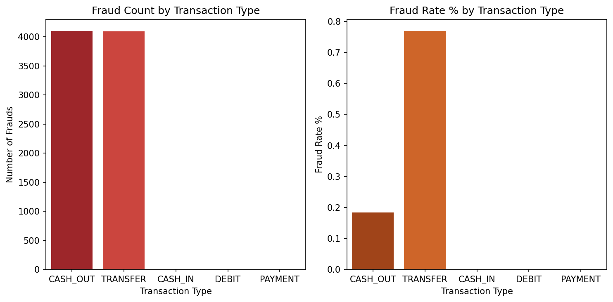
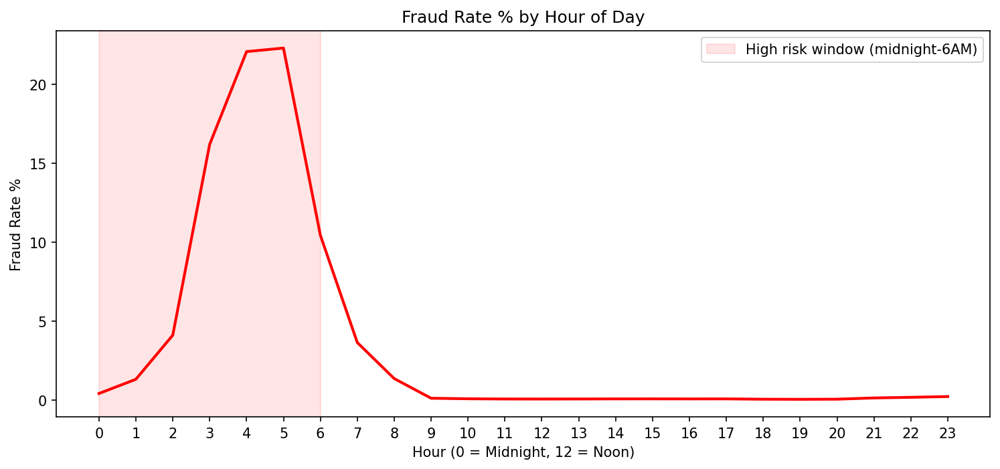
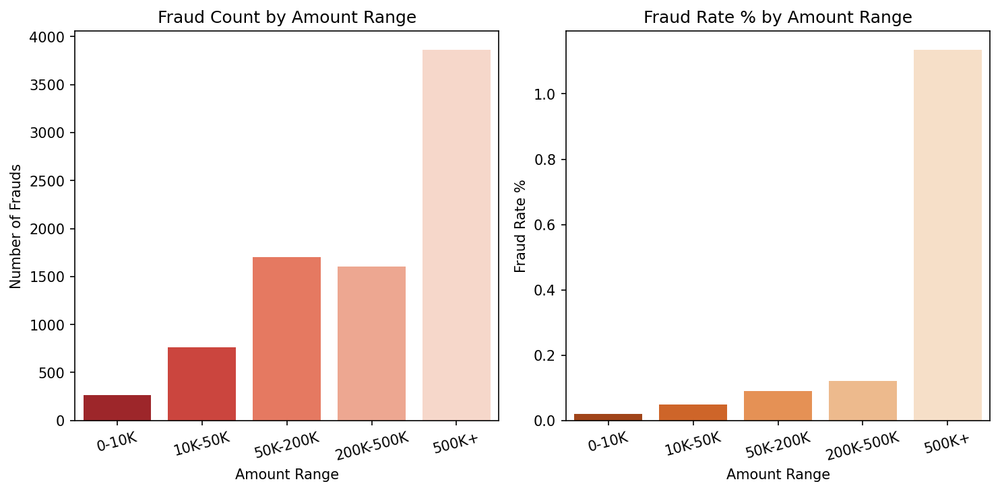

# Digital Payment Fraud Detection & Risk Analysis

## Project Overview
Analysed 6.3 million financial transactions to identify 
fraud patterns, build a predictive detection model, and 
create an interactive Tableau dashboard for business 
decision making.

## Tools Used
| Tool | Purpose |
|---|---|
| Python (Pandas, Scikit-learn, Seaborn) | Data cleaning, EDA, Model building |
| SQL (SQLite) | Business analysis queries |
| Tableau Public | Interactive dashboard |
| Google Colab | Development environment |

## Dataset
- Source: [Kaggle — Financial Transactions Dataset](https://www.kaggle.com/datasets/chitwanmanchanda/fraudulent-transactions-data)
- Size: 6.3 million rows, 11 columns
- Fraud rate: 0.13% (highly imbalanced dataset)
- Transaction types: CASH_OUT, PAYMENT, TRANSFER, CASH_IN, DEBIT

## Key Findings
1. Fraud occurs ONLY in TRANSFER and CASH_OUT transactions
   — PAYMENT, CASH_IN and DEBIT have zero fraud cases
2. Fraud rate peaks at 22% between 3–5 AM — critical 
   window for real time alerts
3. 500K+ transactions have highest fraud concentration 
   with 3,864 fraud cases
4. Fraudsters target high balance accounts — avg fraud 
   amount is 8x higher than normal (₹14.7L vs ₹1.78L)
5. Account drain pattern confirmed — fraud empties 88% 
   of sender balance vs minimal change in normal transactions

## Model Performance
| Metric | Value |
|---|---|
| Algorithm | Random Forest + SMOTE |
| Fraud Catch Rate | 96.03% |
| Overall Accuracy | 98% |
| Fraud Cases Caught | 1,574 out of 1,639 |
| Strongest Predictor | Sender opening balance (37.6%) |

## Live Dashboard
👉 [View Interactive Tableau Dashboard](https://public.tableau.com/app/profile/sucheta.de7420/viz/DigitalPaymentFraudDetectionAnalysis/DigitalPaymentFraudAnalysis?publish=yes)

## Notebook
👉 [View Complete Python Notebook on Google Colab](https://colab.research.google.com/drive/1Bg9b7m3FIeTkVxKP4HYbEBMAmbhzxSk_?usp=sharing)

## Project Structure
| File | Description |
|---|---|
| `Fraud_Detection_Analysis.ipynb` | Complete Python notebook |
| `sql_fraud_by_type.csv` | SQL results — fraud by transaction type |
| `sql_fraud_by_amount.csv` | SQL results — fraud by amount range |
| `sql_fraud_by_hour.csv` | SQL results — fraud by hour |
| `sql_account_drain.csv` | SQL results — account drain analysis |
| `sql_fraud_by_day.csv` | SQL results — daily fraud trend |

## Dashboard Preview

